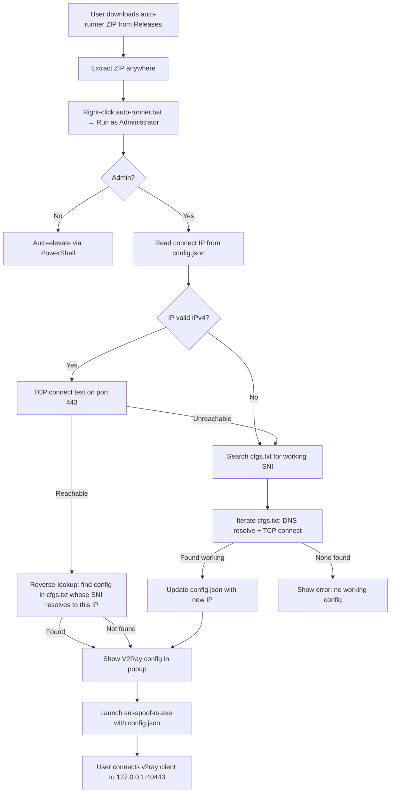

# Release Packaging & Repository Management Plan

## Overview

This plan covers how to ship, package, and manage your fork of `sni-spoof-rs` with the Windows auto-runner as the primary value-add for end users.

---

## 1. Release Packaging Approach

### 1.1 The "Auto-Runner" ZIP (Primary Windows Distribution)

The main deliverable for Windows users is a single zip containing everything needed:

```
sni-spoof-rs-windows-amd64-auto-v0.5.1.zip
├── sni-spoof-rs.exe          # Core Rust binary (from upstream build)
├── WinDivert64.sys           # WinDivert kernel driver
├── WinDivert.dll             # WinDivert user-mode DLL
├── auto-runner.bat           # Entry point — user double-clicks this
├── config.json               # Default config (connect: ":443")
├── cfgs.txt                  # SNI config list (user-provided or shipped)
└── README.txt                # Quick-start instructions
```

**Key design decisions:**
- **Single zip, zero setup** — user extracts and runs `auto-runner.bat` as Admin
- **`auto-runner.bat` is the entry point** — it handles finding a working IP, updating config, showing the V2Ray link, and launching the proxy
- **`cfgs.txt` is NOT shipped by default** (it's in `.gitignore`) — but a `cfgs.example.txt` is provided as a template

### 1.2 The Build/Packaging Script

A new script [`scripts/package-windows.ps1`](scripts/package-windows.ps1) (PowerShell) that:

1. Takes the version tag as a parameter (e.g., `v0.5.1`)
2. Locates the built `sni-spoof-rs.exe` (from `target/release/` or `bins/`)
3. Copies it alongside WinDivert files (from `releases/sni-spoof-rs-windows-amd64.zip`)
4. Copies `runner/auto-runner.bat`, `runner/config.json`
5. Copies `cfgs.example.txt` as `cfgs.txt` (or skips if user provides their own)
6. Creates the final zip with a versioned filename

**Why PowerShell?** — The build environment is Windows, and PowerShell has native `Compress-Archive` support. No external dependencies.

### 1.3 Makefile Integration

Add new targets to the existing [`Makefile`](Makefile):

```makefile
.PHONY: package-windows-auto

package-windows-auto: windows-x64
    powershell -ExecutionPolicy Bypass -File scripts/package-windows.ps1 -Version $(VERSION)
```

This way `make package-windows-auto VERSION=v0.5.1` produces the auto-runner zip.

### 1.4 GitHub Actions CI/CD

A workflow file [`.github/workflows/release.yml`](.github/workflows/release.yml) that:

1. **On push to `main`** — runs `test_auto_runner.py` to validate the batch logic
2. **On tag push (e.g., `v0.6.0`)** — builds the Rust binary, packages the auto-runner zip, and creates a GitHub Release with the zip attached

```yaml
name: Build & Release
on:
  push:
    tags: ['v*']
jobs:
  build-windows:
    runs-on: windows-latest
    steps:
      - uses: actions/checkout@v4
      - uses: actions-rust-lang/setup-rust-toolchain@v1
      - run: cargo build --release
      - run: python runner/test_auto_runner.py
      - run: scripts/package-windows.ps1 -Version $env:GITHUB_REF_NAME
      - uses: softprops/action-gh-release@v2
        with:
          files: dist/sni-spoof-rs-windows-amd64-auto-*.zip
```

---

## 2. Auto-Runner Improvements

### 2.1 Admin Elevation Check

Add to the top of [`runner/auto-runner.bat`](runner/auto-runner.bat):

```batch
@echo off
setlocal enabledelayedexpansion
cd /d "%~dp0"

:: Check for Administrator privileges
net session >nul 2>&1
if %errorlevel% neq 0 (
    echo This script requires Administrator privileges.
    echo Restarting with elevated permissions...
    powershell start -verb runas '%~f0'
    exit /b
)
```

This auto-restarts the script as Administrator if not already elevated.

### 2.2 Replace Ping with TCP Connect

Current issue: Many Cloudflare IPs block ICMP, so `ping` returns false negatives.

Replace the ping step (lines 44-72) with a TCP connect test on port 443, using the same PowerShell `TcpClient` logic already used in STEP 3. This makes the health check consistent and reliable.

### 2.3 Missing Binary Check

Add before STEP 5 (line 136):

```batch
if not exist "sni-spoof-rs.exe" (
    echo ERROR: sni-spoof-rs.exe not found in the current directory.
    echo Make sure it's placed alongside auto-runner.bat.
    pause
    exit /b 1
)
```

---

## 3. Repository Management Strategy

### 3.1 Branch Layout

```
main              ← Stable releases (what users see)
├── develop       ← Active development branch
├── upstream      ← Tracks therealaleph/sni-spoofing-rust main
└── feature/*     ← Feature branches (optional)
```

**Workflow:**
1. Upstream releases a new version → merge into `upstream` branch
2. Resolve conflicts, test, then merge `upstream` into `develop`
3. From `develop`, build binaries, package, tag, and merge into `main`

### 3.2 What to Keep vs Fork-Specific

| Component | Strategy |
|---|---|
| `src/` (Rust code) | Keep in sync with upstream; minimal fork-specific changes |
| `runner/` (auto-runner) | Fork-specific; not in upstream |
| `releases/` (binaries) | Keep; update with each release |
| `README.md` | Fork-specific; add auto-runner section |
| `Makefile` | Fork-specific; add packaging targets |
| `.github/workflows/` | Fork-specific; add CI/CD |

### 3.3 Versioning

- Follow upstream version numbers (e.g., `v0.5.1`) for the Rust binary
- Append a suffix for the auto-runner package version if needed (e.g., `v0.5.1-auto.1`)

---

## 4. Documentation Updates

### 4.1 [`README.md`](README.md) Changes

Add a prominent section at the top:

```markdown
## 🪟 Windows Auto-Runner (This Fork)

This fork adds a **Windows auto-runner** that automates finding a working Cloudflare IP
and SNI, so you don't have to manually update `config.json` when IPs get blocked.

### Quick Start (Windows)

1. Download `sni-spoof-rs-windows-amd64-auto-v*.zip` from [Releases](https://github.com/YOUR_USER/sni-spoof-rs/releases)
2. Extract the zip anywhere
3. Right-click `auto-runner.bat` → **Run as Administrator**
4. The runner will:
   - Check if the current IP is reachable
   - If not, search `cfgs.txt` for a working SNI config
   - Update `config.json` automatically
   - Show your V2Ray config in a popup
   - Launch `sni-spoof-rs.exe`
5. Connect with your v2ray/xray client as usual
```

### 4.2 [`releases/README.md`](releases/README.md) Changes

Add a row for the auto-runner zip:

```markdown
| `sni-spoof-rs-windows-amd64-auto-v*.zip` | Windows x86_64 with auto-runner (exe + WinDivert + batch script) |
```

### 4.3 New File: [`cfgs.example.txt`](cfgs.example.txt)

A commented example showing the format:

```txt
# SNI Spoof Config List
# Format: trojan://... or vless://...
# The auto-runner will test each config's SNI domain for DNS resolution
# and TCP connectivity on port 443, then pick the first working one.
#
# Copy this file as cfgs.txt and add your configs below:

# trojan://user@127.0.0.1:40443?security=tls&sni=example.com&...
# vless://uuid@127.0.0.1:40443?encryption=none&security=tls&host=example.com&...
```

---

## 5. File Changes Summary

| File | Action | Description |
|---|---|---|
| [`scripts/package-windows.ps1`](scripts/package-windows.ps1) | **Create** | PowerShell script to build the auto-runner zip |
| [`.github/workflows/ci.yml`](.github/workflows/ci.yml) | **Create** | CI workflow to run tests on push/PR |
| [`.github/workflows/release.yml`](.github/workflows/release.yml) | **Create** | Release workflow to build + package + publish |
| [`Makefile`](Makefile) | **Modify** | Add `package-windows-auto` target |
| [`runner/auto-runner.bat`](runner/auto-runner.bat) | **Modify** | Add admin check, TCP ping, missing binary check |
| [`README.md`](README.md) | **Modify** | Add auto-runner quick-start section |
| [`releases/README.md`](releases/README.md) | **Modify** | Add auto-runner zip to table |
| [`cfgs.example.txt`](cfgs.example.txt) | **Create** | Example config list template |
| [`.gitignore`](.gitignore) | **Modify** | Add `/dist` and `/scripts` exclusions if needed |

---

## 6. Mermaid Flow: End-to-End User Experience



---

## 7. Implementation Order

1. **Create `scripts/package-windows.ps1`** — the packaging script
2. **Modify `Makefile`** — add packaging target
3. **Modify `runner/auto-runner.bat`** — admin elevation, TCP ping, missing binary check
4. **Create `.github/workflows/ci.yml`** — run tests on every push
5. **Create `.github/workflows/release.yml`** — build + package on tag
6. **Create `cfgs.example.txt`** — template for users
7. **Update `README.md`** — auto-runner section
8. **Update `releases/README.md`** — auto-runner zip row
